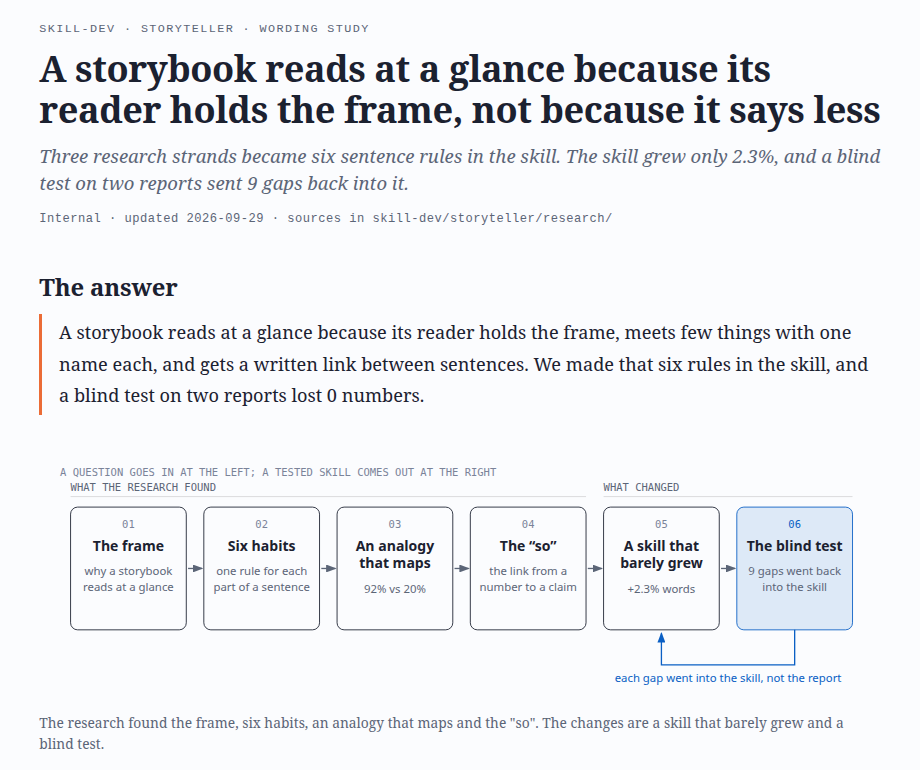
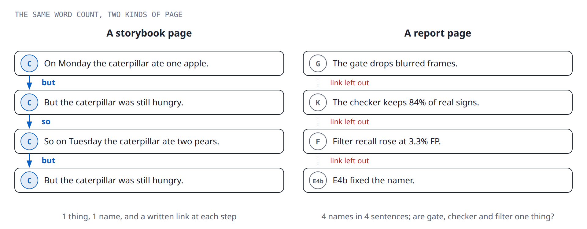
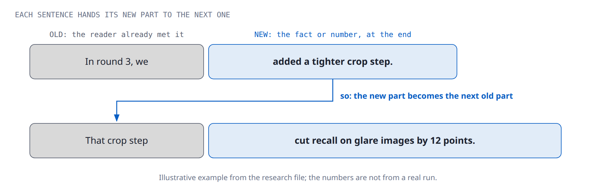
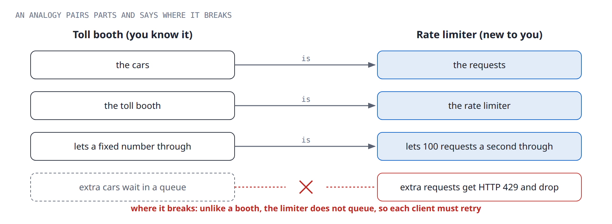

# storyteller

**storyteller is a Claude Code skill that turns technical work into one illustrated HTML story.** A reader with no background can follow it from start to end. The story keeps every number, caveat and decision from the source.



*The first screen gives the answer in two sentences, then one picture of the whole story.*

## Why a report needs this

A child reads a storybook at a glance. An adult can read a report three times and still miss the point. The storybook does not say less: picture books use 1.72× more distinct words than parents use in speech to children [1].

The difference is in how the text works:

- **The reader holds the frame.** A passage is easy when the reader knows its topic first [2].
- **Few things, with one name each.** At the same length, a text with more distinct things reads slower and gives less recall [3].
- **Each sentence links to the last.** Across 20 texts and 794 readers, "because", "so" and "but" raised comprehension [4].

storyteller writes each report the same way.

## What the skill does

| Part | What it gives the reader |
|---|---|
| **A fixed frame** | The answer first, then the story, then the caveats, then one next step with an owner and a date, then an appendix. |
| **A free story** | One shape per report, for example a journey, a detective case or a before and after, with one example from start to end. |
| **A new figure for each chapter** | An inline SVG of the right kind: a scene, a state machine, a sankey, 100 dots, a trade-off. It chooses from about 25 kinds. |
| **Drawers for the audit trail** | The method, the full tables and the rejected options stay one click away, so the story stays short. |
| **Six sentence rules** | See below. |
| **Four checks** | Scripts catch objective defects only: a dropped number, a missing part of the frame, text that is too small on a phone. |

## The six sentence rules



1. **Whole, then parts.** Name the whole first. Then give one part in each sentence, with the actor as subject and the action as verb.
2. **Old, then new.** Start each sentence with something the reader knows. End it on the new fact or number.
3. **One name per thing, one thing per name.** A new word reads as a new thing. This rule applies to prose, figures and tables.
4. **A real case for every claim.** Write out the example, the number or the evidence each time. A claim with no case is a caveat.
5. **Write the link.** Keep "because", "so" and "but". A split that drops the link is worse than one long sentence.
6. **An analogy that maps.** Use an analogy for a new concept when a familiar thing has the same causes. Pair each part, and say where the analogy breaks.



Two examples, before and after the rules (the numbers are only examples):

| Before | After |
|---|---|
| An improvement in the detection of rotated cards was achieved through the introduction of augmentation. | Rotation augmentation taught the detector to find rotated cards. |
| A 12-point recall drop on glare images comes from the new crop step. We added the crop step in round 3. | In round 3 we added a tighter crop step. On glare images, that crop step cut recall by 12 points. |

### When an analogy helps

An analogy helps only when the text pairs its parts. In one classic study, 92% of people solved a new problem when told to use a story they had read. Only 20% solved it without that hint [5]. An analogy also has a cost: it can lower the recall of basic facts [6]. So the skill keeps the real term and the real number next to each analogy.



## Optional teaser video

After the report is done, the skill can suggest a short narrated video for the first screen. It names the scenes
and tells you the token cost first. It builds the video only if you say yes, and it never asks for a simple report.

- The voice comes from Kokoro-82M, a free local model.
- The real screens come from read-only browser stills, with a camera that zooms to what the voice names.
- HyperFrames renders the motion and the captions; 75 s of video renders in about 30 s.

The steps are in `references/teaser.md`, and the template is in `assets/teaser/`.

## Install

Clone the repository into your Claude Code skills folder:

```bash
git clone https://github.com/sytang9/storyteller ~/.claude/skills/storyteller
pip install beautifulsoup4 markdown playwright
python3 -m playwright install chromium
```

The layout check and the PDF output also need Chrome or Chromium on your PATH.

## Use

Ask Claude Code for a report, a write-up or a plain-language version of your work. For example: "Use storyteller to turn results.md into a report for my manager." The skill starts automatically, or you can type `/storyteller`.

The skill builds and checks the page with these scripts:

```bash
S=~/.claude/skills/storyteller/scripts
python3 $S/build_story.py story.src.md                             # renders story.html
python3 $S/check_story.py story.html --ledger ledger.json          # frame, captions, no dropped number
python3 $S/check_ste.py --lite story.html                          # sentence length and plain words
python3 $S/check_svg.py figs/*.svg                                 # accessible figures
python3 $S/check_layout.py story.html                              # six screen sizes, once at the end
```

## What the skill does not do

- **It does not invent numbers.** Each number goes into `ledger.json` first, and the check fails if one drops out.
- **It does not judge taste.** The checks catch only defects. The writer decides the look.
- **It is not for generated pages.** Dashboards and live tables need a different tool.

## Sources

1. Montag, Jones and Smith (2015). The words children hear. *Psychological Science* 26. https://pmc.ncbi.nlm.nih.gov/articles/PMC4567506
2. Bransford and Johnson (1972). Contextual prerequisites for understanding. *JVLVB* 11. https://doi.org/10.1016/S0022-5371(72)80006-9
3. Kintsch et al. (1975). Comprehension and recall of text as a function of content variables. *JVLVB* 14. https://doi.org/10.1016/S0022-5371(75)80065-X
4. Kleijn, Pander Maat and Sanders (2019). Comprehension effects of connectives. *Discourse Processes* 56. https://doi.org/10.1080/0163853X.2019.1605257
5. Gick and Holyoak (1980). Analogical problem solving. *Cognitive Psychology* 12. https://pdf.retrievalpractice.org/transfer/Gick_Holyoak_1980.pdf
6. Donnelly and McDaniel (1993). Use of analogy in learning scientific concepts. *JEP: LMC* 19. https://pubmed.ncbi.nlm.nih.gov/8345330/

Also: Gopen and Swan (1990), "The Science of Scientific Writing", *American Scientist* 78; and ASD-STE100 Simplified Technical English for the sentence limits.

## License

MIT. See [LICENSE](LICENSE). Three scripts and part of a fourth come from [diagram-design](https://github.com/cathrynlavery/diagram-design) by Cathryn Lavery, also under MIT.
